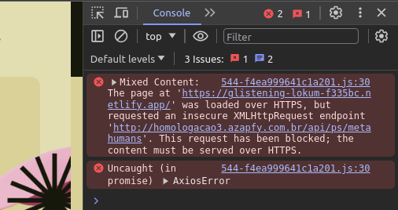

# Memory Board

## Visão Geral
Este projeto faz parte da minha solução do desafio técnico proposto pela empresa [Azapfy]() na vaga de desenvolvedor frontend júnior.

Segundo os critérios do desafio, alguns objetivos foram propostos para avaliar o conhecimento do candidato, sendo eles:

- **Listagem de Heróis:** A partir do consumo de uma API desenvolvida pela empresa, deveria ser realizado um mapeamento de cada um dos heróis(Objetos) retornados pela API.

- **Filtro de Heróis:** Deveria ser possível realizar um filtro dos heróis listados para encontrá-los mais facilmente.

- **Sistema de Combate:** Ao selecionar dois heróis, uma nova aba deveria ser aberta avaliando os atributos de cada herói e decidindo pela somatória de dados, quem é o vencedor.

Além disso, alguns outros requisitos foram pedidos, e naturalmente atendidos:

- [X] Desenvolver a aplicação em **ReactJS**
  > A aplicação foi desenvolvida utilizando **React e Next**.
- [X] Utilizar alguma biblioteca de componentes UI (Material-UI, etc)
  > Decidindo Utilizar Tailwind, optei por usar a biblioteca **DaisyUI**.
- [X] Implementar algum gerenciamento de estado global (React Context, Redux ou **Zustand**)
  > A aplicação faz o gerenciamento de estado global utilizando **Zustand**.
- [X] Estilização com um ou mais métodos (**TailwindCSS**, CSS, CSS-Module, CSS-in-JS)
  > Novamente, foi escolhido o **TailwindCSS** como ferramenta de estilização, além do **Framer Motion** para animações.

## Sumário
- [Visão Geral](#visão-geral)
- [Sumário](#sumário)
- [Como Executar](#como-executar)
- [Tecnologias Utilizadas](#tecnologias-utilizadas)
- [Principais Features](#principais-features)
  - [1. Componente de Dropzone](#1-componente-de-dropzone)
  - [2. State Management com Zustand](#2-state-management-com-zustand)
  - [3. Compressão de Imagens e Conversão para Base64](#3-compressão-de-imagens-e-conversão-para-base64)
  - [4. Context Menu Customizado](#4-context-menu-customizado)
  - [5. Persistência de Dados em LocalStorage](#5-persistência-de-dados-em-localstorage)
- [Instalação e Execução em Ambiente de Desenvolvimento](#instalação-e-execução-em-ambiente-de-desenvolvimento)
- [Arquitetura do Software](#arquitetura-do-software)
- [Créditos e Direitos Autorais](#créditos-e-direitos-autorais)

## Como Executar
Infelizmente a aplicação ainda não pode ser acessada em ambiente de produção, devido a falta de protocolo HTTPS na API fornecida, o que faz com que as requisições sejam bloqueadas, dado que o navegador não permite que uma aplicação HTTPS realize acesso à endpoints HTTP:



Portanto, para executar a aplicação, é necessário fazê-lo localmente, executando alguns passos:

1. Certifique-se de ter o [Node.js](https://nodejs.org/en) instalado em seu computador. Você pode verificar isso rodando o seguinte comando no seu terminal:
   ```cli
   node --version
   ```
   > Se aparecer no seu terminal uma numeração como uma versão, o Node está instalado, certifique-se de ter no mínimo a versão 14.
2. Após ter instalado o Node, também é preciso instalar o [Git]() caso ele não esteja instalado.
   > Para verificar se o Git está instalado, basta rodar um comando similar ao primeiro: `git --version` e verificar se há alguma versão do git.
3. Finalmente, tendo instalado ambas as ferramentas, realize um clone do projeto com o comando abaixo:
   ```cli
   git clone git@github.com:fnandesrafael/azapfy-challenge.git
   ```
    ou também:
    ```cli
    git clone https://github.com/fnandesrafael/azapfy-challenge.git
    ```
4. Em seguida, entre raíz do projeto.
    > Isso pode ser feito no terminal a partir do comando `cd azapfy-challenge`, a partir do diretório que você rodou o comando de clone.

5. Instale as dependências do projeto com o comando `npm install`.
6. Assim que concluído, certifique-se de que a porta `3000` do seu computador está livre, e rode o comando abaixo:
    ```cli
    npm run dev
    ```
7. Após as compilações de código, quando você entrar no endereço `localhost:3000` no seu navegador, a aplicação deverá aparecer.

## Tecnologias Utilizadas
<div style="display: flex; gap: 2px;">
  <a href="https://www.typescriptlang.org/">
    
  </a>

  <a href="https://react.dev">
    
  </a>

  <a href="https://react-dropzone.js.org/">
    
  </a>

  <a href="https://react-icons.github.io/react-icons/">
    
  </a>

  <a href="https://docs.pmnd.rs/zustand/getting-started/introduction">
    
  </a>

  <a href="https://styled-components.com/">
    
  </a>

  <a href="https://styled-components.com/">
    
  </a>

  <a href="https://www.framer.com/motion/">
    
  </a>
</div>

## Arquitetura do Software

```cli
src/
├── components/
│   ├── (componentes React aqui)
│
├── app/
│   ├── (toda a estrutura do next aqui)
│
├── api/
│   ├── (chamadas axios aqui)
│
├── store/
│   ├── (gerenciamento de estado global aqui)
│
└── utils/
    ├── (funções utilitárias aqui)
```

Fora do diretório `/src`, encontram-se apenas arquivos de configuração, módulos, documentações etc. Além dos arquivos públicos, assets e imagens no diretório `/public`.

## Créditos e Direitos Autorais

Todos os códigos desse projeto foram por mim desenvolvidos, os quais possuo direito de propriedade intelectual. No entanto, alguns assets como: fontes, imagens, texturas e bibliotecas, foram utilizados de terceiros, e a estes pertencem.
Sendo esse apenas um projeto de cunho educacional, sem fins lucrativos, apenas tendo o fim o aperfeiçoamento do meu currículo e das minhas habilidades práticas de desenvolvimento frontend.

© Rafael Fernandes de Lima - 2023
